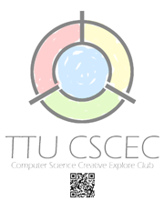
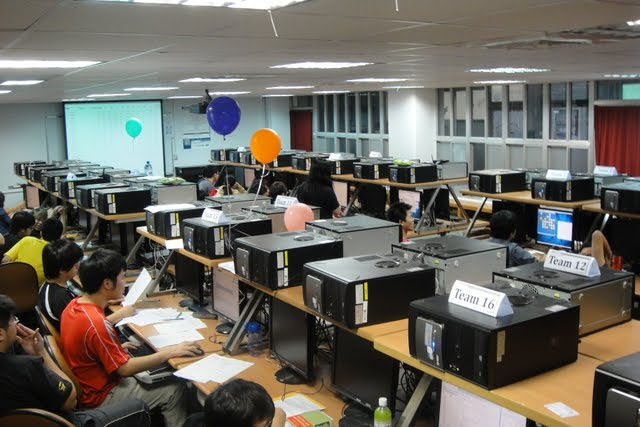
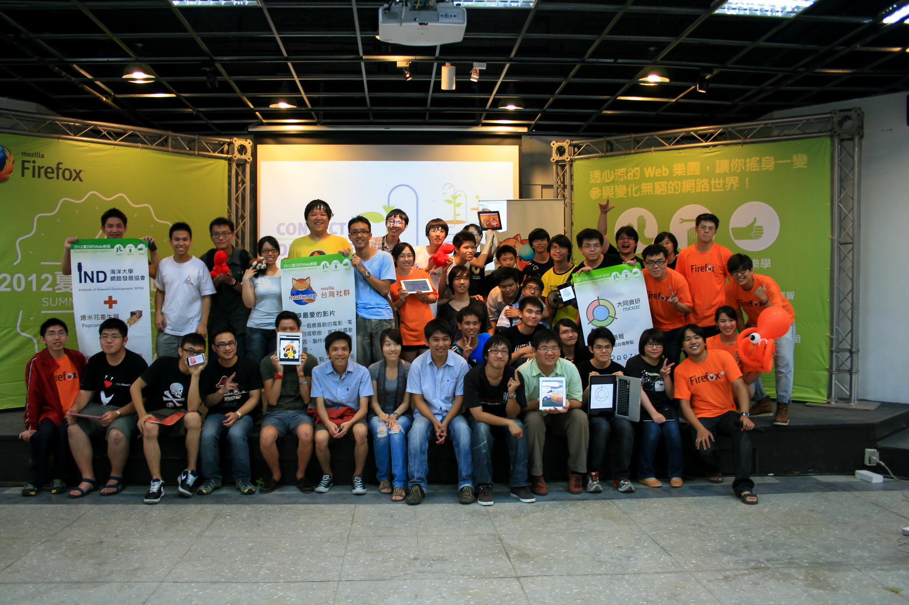
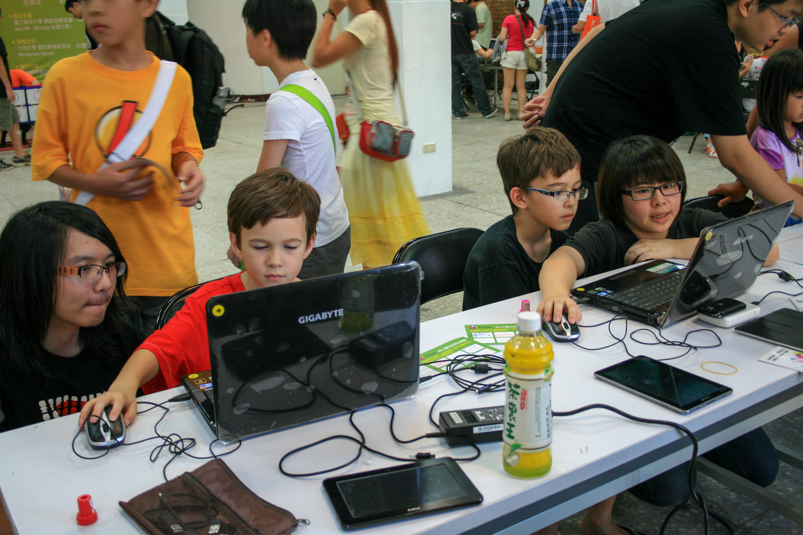

title: 社群心法： 如何經營與規劃社群活動
output: index.html

--

<h1 style="font-size: 68px">
  社群心法： 
  如何經營與規劃社群活動
</h1>
 

## SITCON 共同發起人
## Denny Huang
 
<h2 style="font-size: 16px">
2022/09/17 - 2022 Google Developers Community Leads Summit
</h2>

--

### Who am I ?

 
<h2 style="font-size: 60px">
  <b>Denny Huang</b>
</h2>

* SITCON 共同發起人，2013、2014 總召

* Rayark Inc. - Data Team Lead

* <a href="https://denny.one/" target="_blank">About me</a>

--

  
  <h2>學生計算機年會</h2>
  <h2>Students’ Information Technology Conference</h2>
  <a href="http://sitcon.org/">https://sitcon.org/</a>

--

### 社團/社群參與
- SITCON
- COSCUP 2022 總召組
- HITCON PEACE 2022 副召
- 大同大學資訊創意研究社 創社社長
- 大同大學魔術社 社長（100 學年度）
- 成淵高中魔術社 創社社長

--

# 動機？

--

# 社群

--

# 緣起

--

# COSCUP
## 開源人年會

--

 

  

--

### 2012 / 08 / 26

  

--

  
  <h2>學生計算機年會</h2>
  <h2>Students’ Information Technology Conference</h2>
  <a href="http://sitcon.org/">https://sitcon.org</a>

--

# 給學生一個發表的舞台。

--

# 研討會
## Since 2013
## 200 人 -> 1300 人

--

  

--

  

--

  

--

  

--

# 讓一群熱愛資訊的人有交流的機會。

--

### 中央研究院 人文社會科學館 since 2014

  

--

<iframe width="800" height="600" src="https://www.youtube.com/embed/TFIvDnINWBM" frameborder="0" allow="accelerometer; autoplay; encrypted-media; gyroscope; picture-in-picture" allowfullscreen></iframe>

--

# 經營

--

# 總召

--

# Coordinator

--

### 領導者
- 與團隊成員平等
- 凝聚共識
- 講好故事
	- 破除知識詛咒
- 關心你的夥伴們
	- 團隊成員
	- 利害關係人

--

# 活動舉辦

--

# Workshop

--

  

--

  

--

  

--

--

--

--

# Summer Camp
## Since 2014

--

# 營火晚會

--

# ~~營火晚會~~

--

# 黑客松

--

# 夜教

--

# ~~夜教~~

--

# 密室逃脫
## 結合資訊

--

# 社群闖關

--

# 視界咖啡館

--

<iframe width="800" height="600" src="https://www.youtube.com/embed/oAtiOrpj6DQ" frameborder="0" allow="accelerometer; autoplay; encrypted-media; gyroscope; picture-in-picture" allowfullscreen></iframe>

--

<h1>
  
</h1>
## http://hackgen.sitcon.org/

--

  

--

# 定期聚

--

### 定期聚

- 台北
- 桃園
- 新竹
- 台中
- 台南
- 高雄
- 花蓮

--

# Hour of Code

--

  

--

  

--

# 傳統?

--

# 目的

--

# 目標受眾
## TA, Target Audience

--

### [大同大學資訊創意研究社](https://ttucsc.denny.one/)
 

  

--

### 社課 - 認識 Linux 發行版

  

--

### [社團程式設計競賽](https://ttucsc.denny.one/sites.google.com/site/ttucsc/programming_competition_3rd.html)

  

--

### 2012 夏日的 Web 樂園 with Mozilla

  

--

### 2012 夏日的 Web 樂園 with Mozilla

  

--

# 傳承

--

  

--

<h1 style="font-size: 72px">
  SITCON 籌備 / 開源專案
</h1>

--

# 紀錄
## [Mailing List](https://groups.google.com/g/sitcon-general) / [Google Drive](https://drive.google.com/drive/folders/0AIx9UW7aBiDgUk9PVA) / [HackMD](https://hackmd.io/@SITCON) / [GitLab](https://gitlab.com/sitcon-tw/2022/2022-board/-/issues)

--

# [預約跳坑](https://sitcon.org/2022/staff)

--

<h1 style="font-size:72px">Thanks for listening</h1>
