title: SITCON
output: index.html

--

<h1 style="font-size: 72px">
  SITCON 
  學生計算機年會
</h1>
 

## SITCON 共同發起人
## Denny Huang

--

### Who am I ?

 
<h2 style="font-size: 60px">
  <b>Denny Huang</b>
</h2>

* SITCON 2013, 2014 總召

* Rayark Inc.

* <a href="http://about.me/denny0223" target="_blank">About me</a>

--

# 緣起

--

# COSCUP
## 開源人年會

--

 

  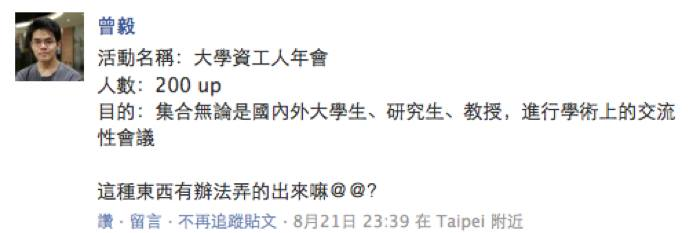

--

### 2012 / 08 / 26

  

--

  
  <h2>Students’ Information Technology Conference</h2>
  <a href="http://sitcon.org/">https://sitcon.org</a>

--

# 給學生一個發表的舞台。

--

# 研討會
## Since 2013
## 200 人 -> 1200 人

--

  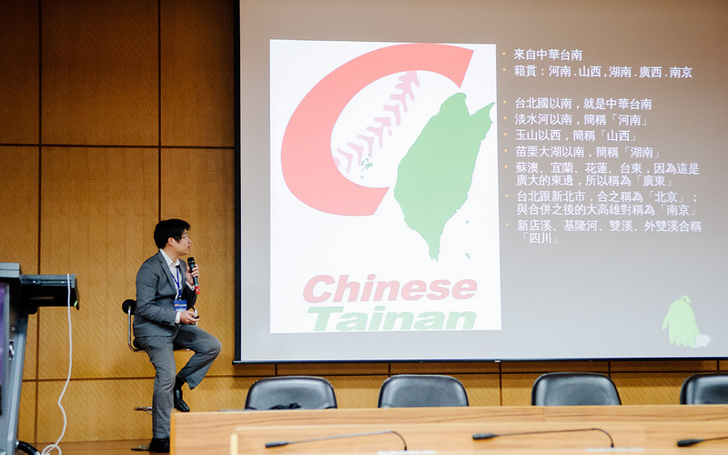

--

  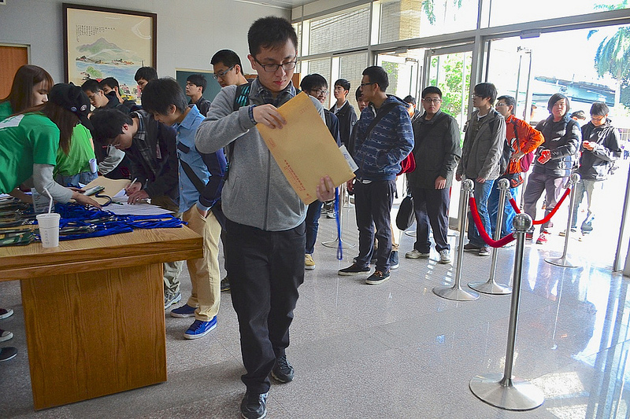

--

  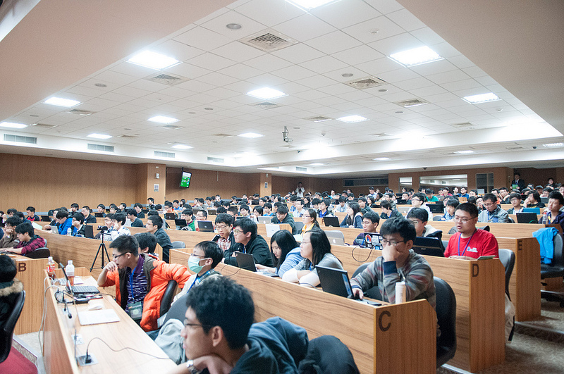

--

  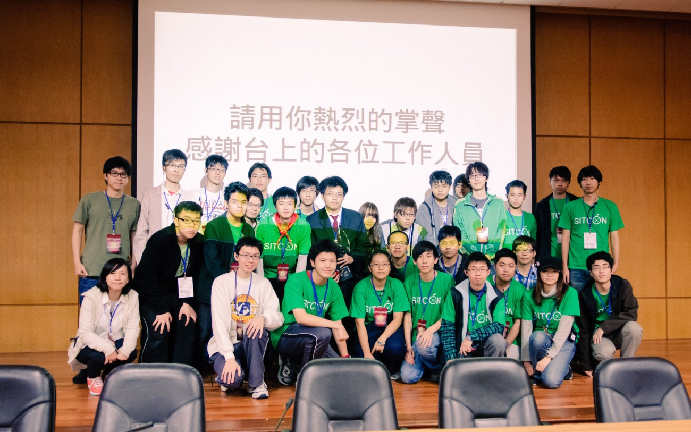

--

# 讓一群熱愛資訊的人有交流的機會。

--

  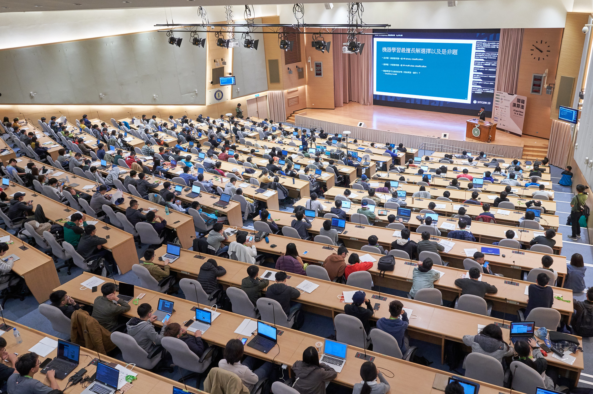

--

<iframe width="800" height="600" src="https://www.youtube.com/embed/rlCiwaC-UUE" frameborder="0" allow="accelerometer; autoplay; encrypted-media; gyroscope; picture-in-picture" allowfullscreen></iframe>

--

### 年會主題
- 2014: 學生與創新實做
- 2015: The True Hackers
- 2016: Let's Open Source!
- 2017: Internet For Next Generation
- 2018: Popular Computer Science
- 2019: Algorithm in a Box 開箱演算法

--

### 論壇
- 2013: 你想用 coding 改變怎樣的世界
- 2014: 學生與實作能力
- 2015: 「學生參與校務系統開發」、「校園 Open Data、Open API」
- 2016: 論臺灣資訊普及教育：過去、現在與未來
- 2017: 同學，你這樣經營社群？學生資訊社群的藝術
- 2018: 台灣學術環境網路的監管與治理
- 2019: 你決定的演算法與決定你的演算法

--

  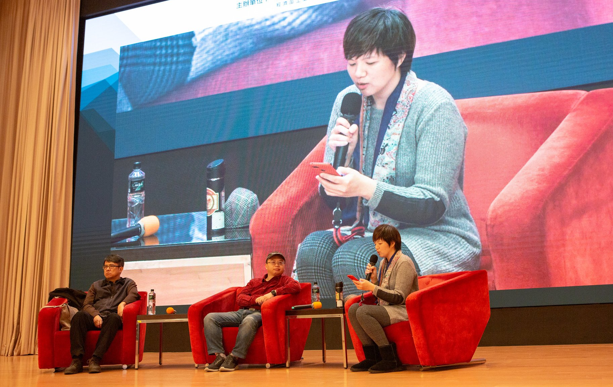

--

### 投稿議程
- Talk / Presentation

- Short Talk / Espresso

- Unconf

- Lightning Talk

--

# SITCON 2020
## 2020 / 03 / 28
## 中央研究院 人文社會科學館

--

# Workshop

--

  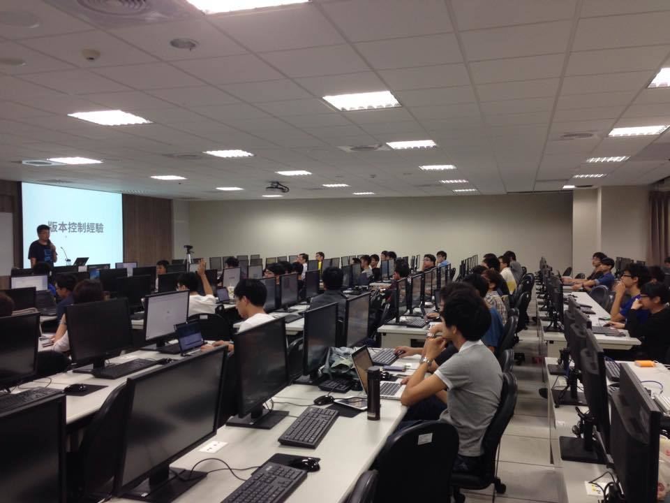

--

  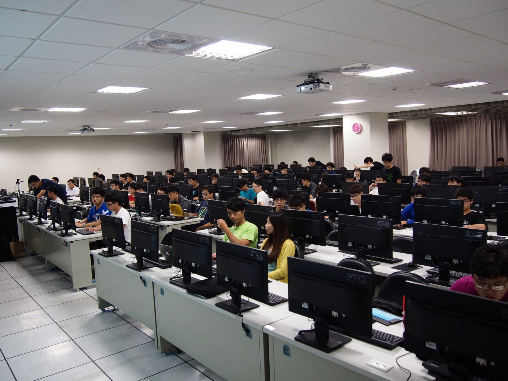

--

  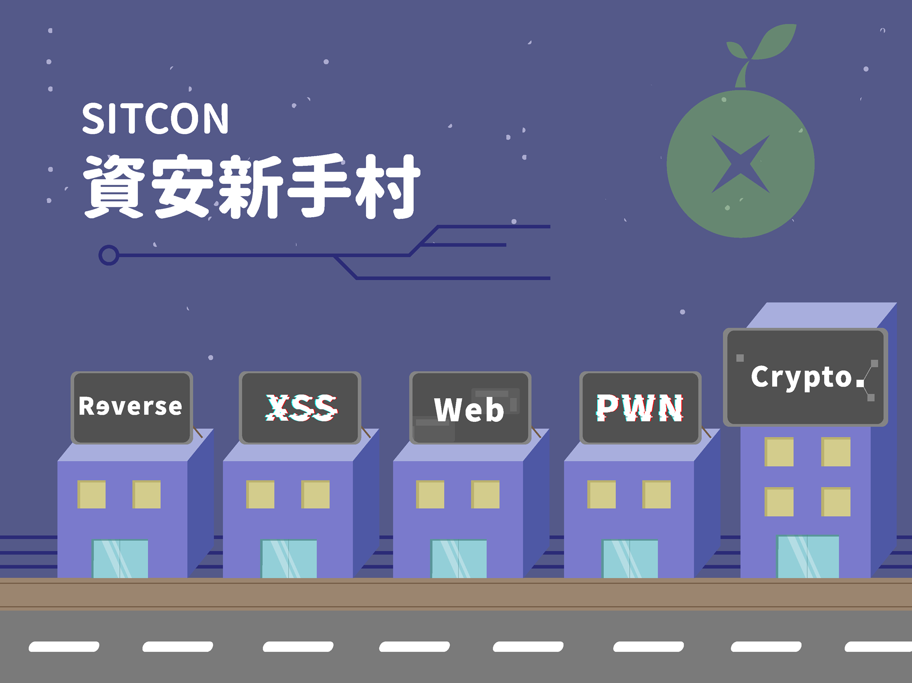

--

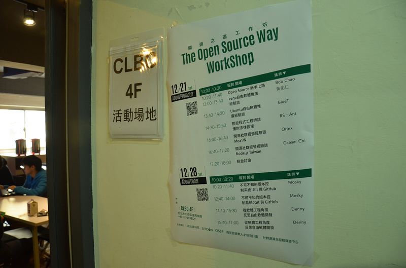

--

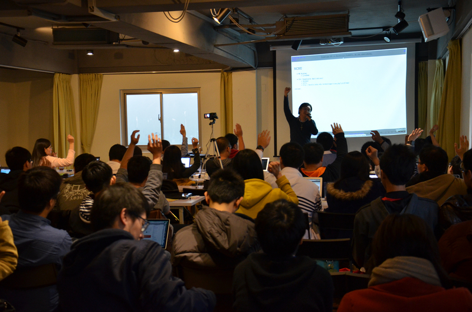

--

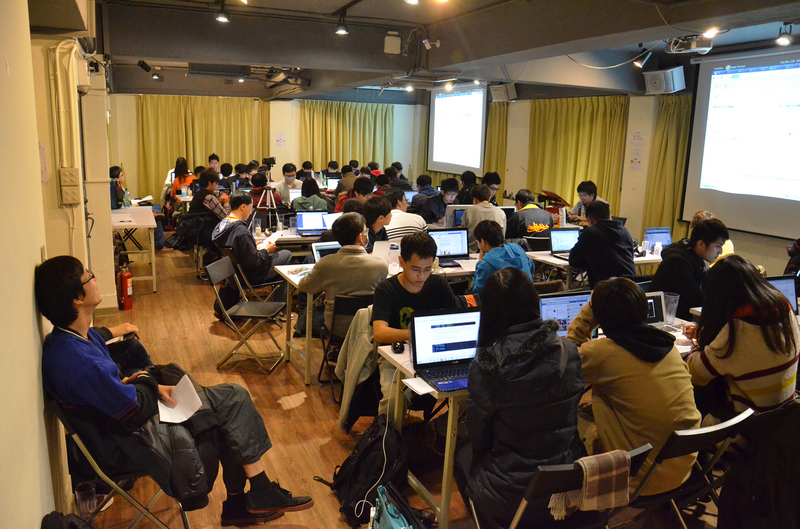

--

# Summer Camp
## Since 2014

--

# 營火晚會

--

# ~~營火晚會~~

--

# 黑客松

--

# 夜教

--

# ~~夜教~~

--

# 密室逃脫
## 結合資訊

--

# 社群闖關

--

# 視界咖啡館

--

<iframe width="800" height="600" src="https://www.youtube.com/embed/oAtiOrpj6DQ" frameborder="0" allow="accelerometer; autoplay; encrypted-media; gyroscope; picture-in-picture" allowfullscreen></iframe>

--

<h1>
  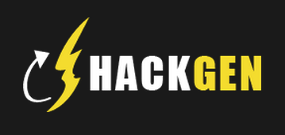
</h1>
## http://hackgen.sitcon.org/

--

  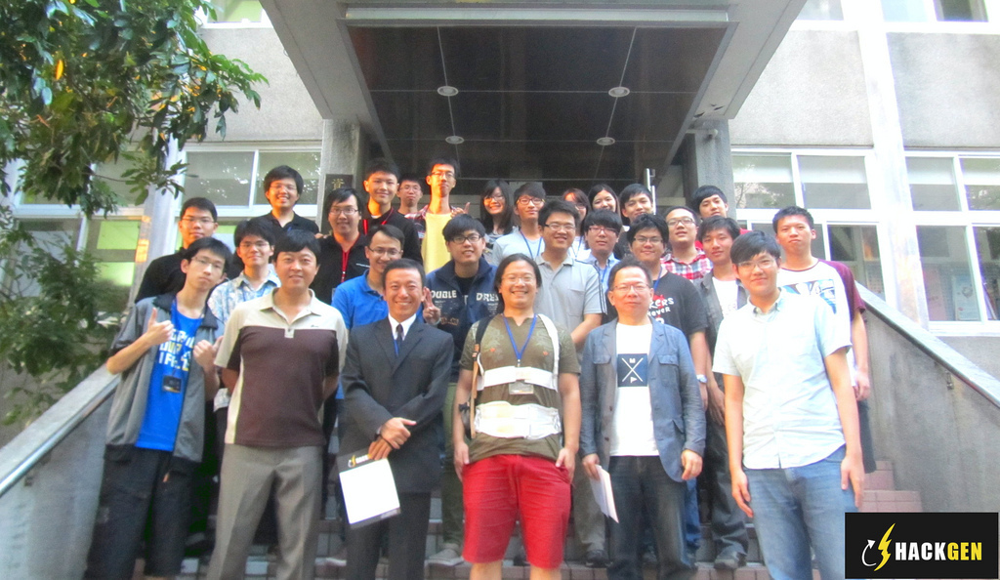

--

# 定期聚

--

### 定期聚

- 台北
- 桃園
- 新竹
- 台中
- 台南
- 高雄
- 花蓮

--

# Hour of Code

--

  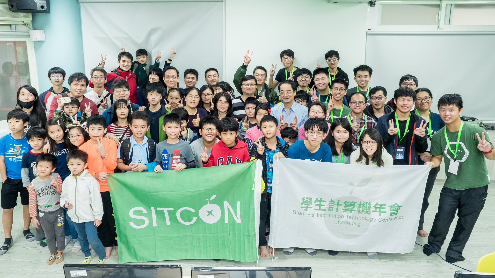

--

  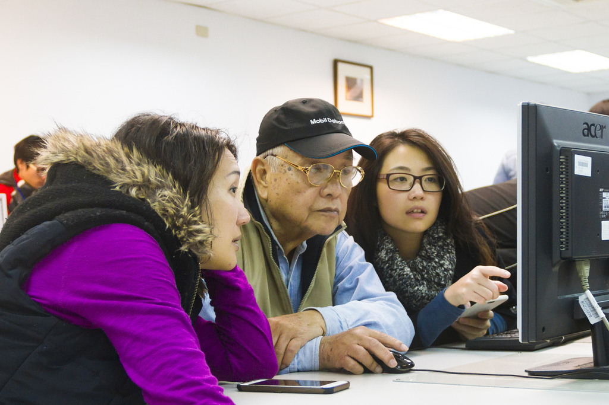

--

# 海外影響

--

### 香港

  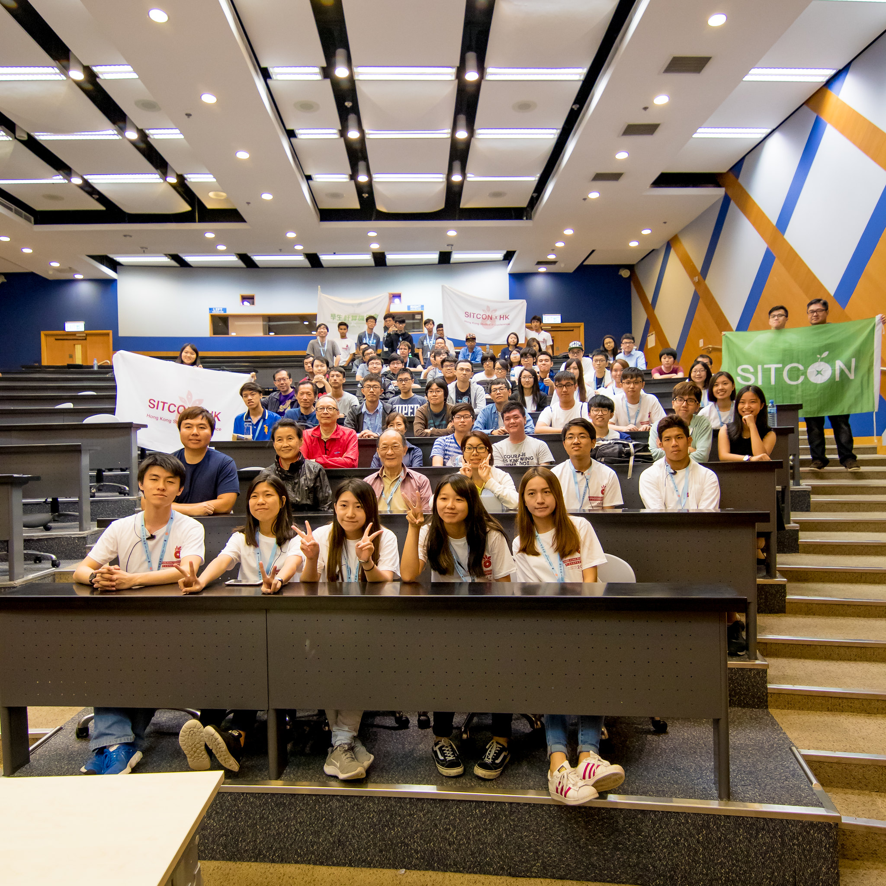
  <h2>SITCON x HK</h2>

--

### 中國

  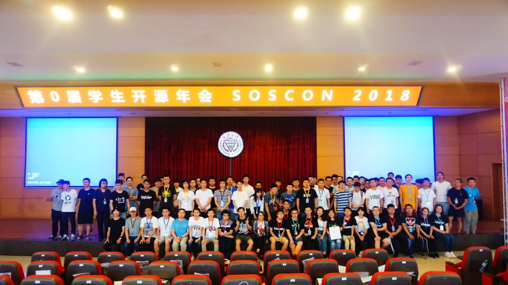
  <h2>SOSCON 學生開源年會</h2>

--

  

--

<h1 style="font-size: 72px">
  SITCON 籌備 / 開源專案
</h1>

--

# 傳統?

--

# 目的

--

# 紀錄
## Mailing List / Google Drive / HackMD

--

<h1 style="font-size:72px">Thanks for listening</h1>
